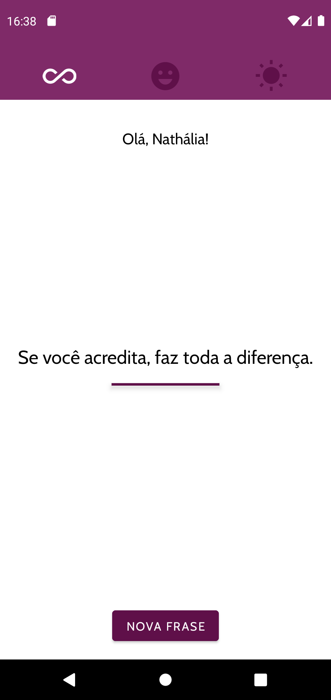
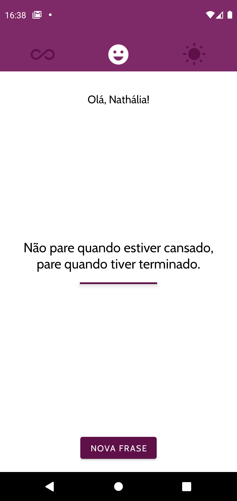
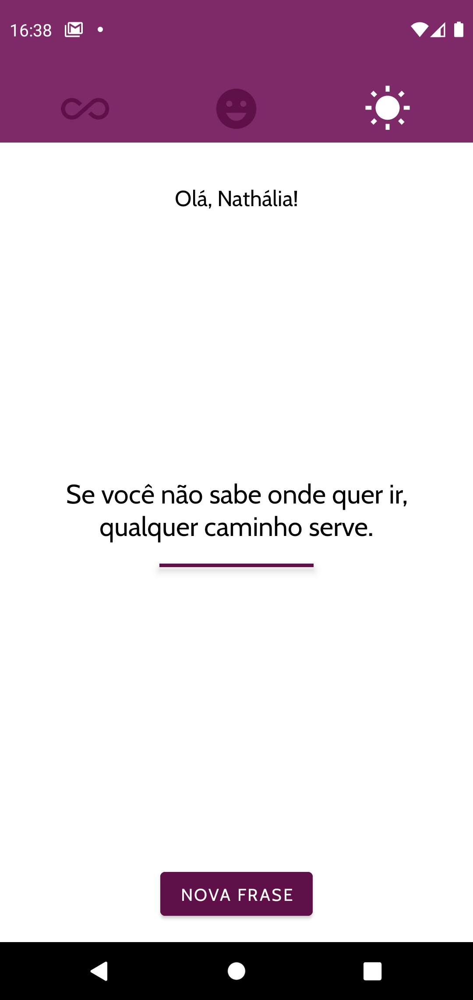

## Motivation-app-android

### 📄 Descrição:

Aplicativo Android, desenvolvido com Kotlin, que mostra frases motivacionais de acordo com o emoji escolhido na parte superior.

##

### 📲 Layout:

- tela com frase do 1º emoji:
<h1>
  
</h1>
 

- tela com frase do 2º emoji:
<h1>
  
</h1>
 

- tela com frase do 3º emoji:
<h1>
  
</h1>

### 📍 Autora:

- NATHÁLIA MIRIAM
- LinkedIn: https://www.linkedin.com/in/nathaliamiriam/
- Portfólio: https://nathaliamiriam.github.io/
